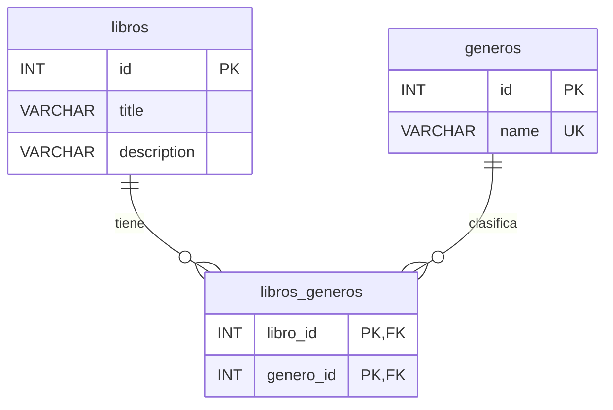

# Cómo Crear una Aplicación CRUD con FastAPI

## Índice

1. [Introducción](#1-introducción)
2. [Estructura de Archivos y Carpetas](#2-Estructura-de-Archivos-y-Carpetas)
3. [Instalación y Configuración](#3-Instalación-y-Configuración)
4. [Conceptos Fundamentales](#4-conceptos-fundamentales)
5. [Flujo de Trabajo en FastAPI](#5-flujo-de-trabajo-en-fastapi)
6. [Comandos Esenciales](#6-comandos-esenciales)
7. [Ejemplo Completo: Aplicación CRUD](#7-ejemplo-completo-aplicación-crud)
8. [Relación Muchos a Muchos: Libros ↔ Géneros](#8-relación-muchos-a-muchos-libros--géneros)
9. [Probando las Rutas con la Documentación de FastAPI](#9-probando-las-rutas-con-la-documentación-de-fastapi)
10. [Despliegue en Producción](#10-despliegue-en-producción)
11. [Recursos Adicionales](#11-recursos-adicionales)

---

## 1. Introducción

FastAPI es un moderno y rápido (de alto rendimiento) framework web para construir APIs con Python 3.6+ basado en estándares Python. En este README, aprenderemos cómo crear una aplicación CRUD (Create, Read, Update, Delete) utilizando FastAPI.

🚀 FastAPI permite crear APIs RESTful de manera rápida y eficiente, con validación automática, serialización y documentación interactiva.

💻 Desarrollado por Sebastián Ramírez, FastAPI se basa en Starlette para el manejo web y Pydantic para la validación de datos, lo que lo hace extremadamente rápido y fácil de usar.

🔧 FastAPI es ideal para microservicios, aplicaciones serverless, y APIs que requieren alto rendimiento y facilidad de desarrollo.

## 2. Estructura de Archivos y Carpetas

```plaintext
book_crud/
│
├── main.py                   
├── config
│   ├── __init__.py
│   └── config_variables.py
|
├── database
│   ├── __init__.py
│   └── database.py
|                   
├── models/
│   ├── __init__.py
│   └── libro_model.py
|
├── schemas
│   ├── __init__.py
│   └── libro_schema.py
|
├── routes
│   ├── __init__.py
│   └── routes.py         
│
├── controllers/
│   ├── __init__.py
│   └── libro_controller.py   
│
├── .env #opcional
│
└── db.sqlite3 #Este archivo se creará solo ;)
```

- `venv/`: Directorio del entorno virtual de Python.
- `__init__.py`: Archivo que convierte el directorio en un paquete Python.
- `main.py`: Contiene la instancia principal de la aplicación FastAPI y laconfiguración global.
- `config_variables.py`: Guarda las variables de entorno utilizando pydantic_settings.
- `database.py`: Maneja la configuración y conexión a la base de datos.
- `models.py`: Define los modelos de SQLAlchemy que representan las tablas de la base de datos.
 - `schemas.py`: Contiene los esquemas Pydantic para la validación de datos yserialización.
- `controllers.py`: Implementa la lógica de negocio y las operaciones CRUD.
- `routes.py`: Define las rutas y endpoints de la API.
- `requirements.txt`: Lista todas las dependencias del proyecto para una fácil instalación.
- `README.md`: Proporciona documentación e instrucciones para el proyecto (este archivo).

## 3. Instalación y Configuración

1. Crear la estructura de directorios:
```
mkdir book_crud
cd book_crud
```
### Instalar FastAPI y dependencias

2. Crear un entorno virtual:
```
python -m venv venv
source venv/bin/activate
```

3. Instalar FastAPI y dependencias:
```
pip install fastapi[all] sqlalchemy
```
si no te permite utilizar `[all]` entonces instala:

```
pip install fastapi sqlalchemy uvicorn pymysql
```

Crea las carpetas que necesites y dentro los archivos que vayas a utilizar, la arquitectura de tu proyecto puede cambiar, sin embargo recuerda que queremos **escalabilidad**, por lo que necesitamos dividir la lógica de los distintos servicios, y las conexiones con otras partes de la aplicación, es decir crea las carpetas y archivos (los archivos son los que tienen extensiones como ".py", las carpetas no tienen extensión):

```plaintext
book_crud/
│
├── main.py                   
├── config
│  ├── __init__.py
│  └── config_variables.py
|
├── database
│   ├── __init__.py
│   └── database.py
|                   
├── models/
│   ├── __init__.py
│   └── libro_model.py
|
├── schemas
│   ├── __init__.py
│   └── libro_schema.py
|
├── routes
│   ├── __init__.py
│   └── routes.py         
│
├── controllers/
│   ├── __init__.py
│   └── libro_controller.py   
│ 
└──.env #opcional
```

2. Configurar las variables de entorno y usar el diectorio y archivo `config/config_variables.py`:

   Para eso primero debemos instalar la dependencia pertinente, en este caso **pydantic_settings**, librería que nos da una serie de herramientas para permitir que nuestro sistema pueda acceder a información pertinente durante el desarrollo.
   
   Pydantic es una librería de Python que se utiliza para validar, convertir y estructurar datos usando tipado de Python. Pydantic se asegura de que los datos que entran y salen de tu aplicación tengan la forma, el tipo y el contenido correcto.
   
   ```
   pip install pydantic-settings
   ```

   Nos dirigimos al directorio `config/` y dentro de esta carpeta nos dirigimos al archivo `config_variables.py` y escribimos:
    
    ```python
    from pydantic_settings import BaseSettings


    class Settings(BaseSettings):
        DB_USER: str = "nombre-del-ddbb-user"
        DB_PASSWORD: str = "contraseña-ddbb"
        DB_HOST: str = "ddbb-host"
        DB_NAME: str = "nombre-ddbb"


    settings = Settings()
    ```

    **Pero** si quisieramos hacer nuestro entorno más seguro podriamos usar el paquete `python-dotenv` y un archivo `.env`:

    ```python
    pip install python-dotenv
    ```

   Ahora para guardar estas dependencias con sus versiones en un archivo `requirements.txt` hacemos:

   ```bash
   pip freeze >> requirements.txt
   ```
   Luego en tu archivo `.env`:
   
    ```python
    DB_USER=nombre-del-ddbb-user
    DB_PASSWORD=contraseña-ddbb
    DB_HOST=ddbb-host
    DB_NAME=nombre-ddbb
    ```
   Entonces el archivo `config/config_variables.py` se veria de esta manera:
    
   ```python
   # config/config_variables.py

   import os
   from dotenv import load_dotenv

   # Cargar variables del .env
   load_dotenv()


   class Settings:
       DB_USER: str = os.getenv("DB_USER", "default_user")
       DB_PASSWORD: str = os.getenv("DB_PASSWORD", "default_password")
       DB_HOST: str = os.getenv("DB_HOST", "localhost")
       DB_NAME: str = os.getenv("DB_NAME", "test_db")


   settings = Settings()
   ```
   

4. Configurar la base de datos en `database/database.py` y en `MySQL Workbench`:
   ```python
   # database/database.py

   from sqlalchemy import create_engine
   from sqlalchemy.ext.declarative import declarative_base
   from sqlalchemy.orm import sessionmaker
   from config.config_variables import settings

   # Variables de entorno para no exponer información sensible
   DB_USER = settings.DB_USER
   DB_PASSWORD = settings.DB_PASSWORD
   DB_HOST = settings.DB_HOST
   DB_NAME = settings.DB_NAME

   # Conexión con la base de datos
   DATABASE_URL = (
       "mysql+pymysql://"
       + DB_USER
       + ":"
       + DB_PASSWORD
       + "@"
       + DB_HOST
       + "/"
       + DB_NAME
       + ""
   )  # MySQL

   # Crea un engine
   engine = create_engine(DATABASE_URL)

   # Crea una clase para configurar la sesión
   Session = sessionmaker(autocommit=False, autoflush=False, bind=engine)

   # Crea una clase base para los modelos
   Base = declarative_base()


   # función para obtener la sesión de la base de datos
   def get_db():
       db = Session()  # Crea una nueva sesión
       try:
           yield db  # Usa la sesión
       finally:
           db.close()  # Cierra la sesión al terminar


   # Esta función crea una sesión para trabajar con la base de datos, la devuelve mientras haces algo (yield db) y la cierra automáticamente al terminar.
   # Se usa mucho en frameworks como FastAPI para que cada petición tenga su propia sesión limpia.
   ```
   
   ### Creamos nuestra conexión en Workbech

   
   

   Ahora entramos a la conexión y creamos una base de datos
   
   
   
   Nos aseguramos de estar en `schemas` y no en `Administration`
   
   
   
   Creamos la base de datos
   
   

   Le ponemos como nombre `book_crud` y hacemos click en el botón `apply` que está al final de esa vista:
   
   
   

   Si no ves tu base de datos, o que haya habido alg[un cambio, refresca haciendo click en estas flechas:
   
   

   Hacemos click derecho sobre la opción `tables` (la cual está dentro de book_crud en el menú lateral), y hacemos click en `create table` para así crear una nueva tabla:
   
   

   A la tabla le colocaremos como nombre `libros` y sus atributos serán `id`, `title`, `description` y volvemos a hacer click en `apply`:
   
   

   ### Comprobamos que estamos correctamente conectados a la base de datos

   Para comprobar que estamos conectados a la base de datos necesitamos que nuestro archivo `main.py` tenga definido el arranque de la aplicación:

   ```python
   from fastapi import FastAPI

   app = FastAPI()

   # IMPORTANTE: Aquí referenciamos el archivo "database" no la variable "db"
   from database import database


   def run():
       pass


   if __name__ == "__main__":
       database.Base.metadata.create_all(database.engine)
       run()


   @app.get("/")
   async def root():
       return {"message": "Hello World"}
   ```

   Y luego en nuestra terminal ejecutamos:

   ```bash
   uvicorn main:app --reload
   ```

## 4. Conceptos Fundamentales

- **create_engine**: Piensa en esto como construir la tubería que conecta tu código con la base de datos.

- **declarative_base**: Es una plantilla para crear tus tablas como si fueran clases de Python.

- **sessionmaker**: Es como un generador de “mesas de trabajo” para interactuar con la base de datos sin tocarla directamente. Con la sesión puedes consultar, insertar, actualizar o borrar datos sin afectar inmediatamente la base de datos real hasta que confirmes los cambios.
  - **autocommit=False** → No confirma automáticamente los cambios, tú decides cuándo guardar.
  - **autoflush=False** → No envía automáticamente los cambios hasta que decidas.
  - **bind=engine** → Le decimos a la sesión que use esa tubería que creamos antes para conectarse.

- **Modelos**: Representan las tablas en la base de datos.
- **Schemas**: Definen la estructura de los datos para la serialización/deserialización.
- **CRUD**: Operaciones básicas (Create, Read, Update, Delete) para manipular datos.
- **Dependencias**: Funciones que FastAPI ejecuta antes de las funciones de ruta.
- **Pydantic**: Biblioteca para validación de datos y configuraciones.

## 5. Flujo de Trabajo en FastAPI

1. Definir modelos de base de datos
2. Crear schemas Pydantic
3. Implementar operaciones CRUD
4. Definir rutas de la API
5. Configurar la aplicación principal

## 6. Comandos Esenciales

- `fastapi run main.py`: Inicia el servidor de desarrollo
- `uvicorn main:app --reload`: Inicia el servidor de desarrollo
- `pytest`: Ejecuta las pruebas (si están configuradas)
- `alembic revision --autogenerate`: Genera una migración de base de datos (si se usa Alembic)
- `alembic upgrade head`: Aplica las migraciones pendientes

## 7. Ejemplo Completo: Aplicación CRUD

### Modelos (`models/libro_model.py`)

```python
from sqlalchemy import Column, Integer, String
from database.database import Base


class Libro(Base):
    __tablename__ = "libros"

    id = Column(Integer, primary_key=True)
    title = Column(String, index=True, nullable=False)
    description = Column(String, index=True)
```

### Schemas (`schemas/libro_schema.py`)

```python
from pydantic import BaseModel

# Hereda todo de ItemBase.
# Se usa cuando el usuario envía datos para crear un item.
# “pass” significa que no añadimos nada nuevo, solo usamos lo que está en ItemBase.


class LibroBase(BaseModel):
    title: str
    description: str = None


class LibroCreate(LibroBase):
    pass


class Libro(
    LibroBase
):  # Hereda de ItemBase (title y description) y añade el id que ya existe en la base de datos.
    id: int

    class Config:
        orm_mode = True  # permite que Pydantic lea directamente objetos de SQLAlchemy como si fueran diccionarios, para enviarlos en respuestas JSON.
```

### Operaciones CRUD (`controllers/libro_controller.py`)

```python
from sqlalchemy.orm import Session
from schemas import libro_schema
from models.libro_model import Libro


class CrudControllers:
    """
    Si no usaramos @static methos tendriamos que escribir:

    def __init__(self, db: Session): # El trabajador ya tiene su caja de herramientas (self.db) y no necesita traer nada externo cada vez.
            self.db = db

    y el controlador se vería así:

    def create_item(self, item: crud_schema.ItemCreate): # No hace falta pasar db:session cada vez
            db_item = Item(**item.dict())
            self.db.add(db_item)
            self.db.commit()
            self.db.refresh(db_item)
            return db_item
    """

    @staticmethod
    def get_Libros(db: Session):
        return db.query(Libro).all()

    @staticmethod  # Cada función es como un trabajador independiente que llega con su propio conjunto de herramientas (db) y hace su tarea.
    def get_Libro_by_id(db: Session, Libro_id: int):
        return db.query(Libro).filter(Libro.id == Libro_id).first()

    @staticmethod
    def create_Libro(db: Session, libro: libro_schema.LibroCreate):
        db_libro = Libro(
            **libro.dict()
        )  # libro.dict() funciona porque es un Pydantic model
        db.add(db_libro)
        db.commit()
        db.refresh(db_libro)
        return db_libro

    @staticmethod
    def update_Libro(db: Session, Libro_id: int, libro: libro_schema.LibroCreate):
        db_Libro = db.query(Libro).filter(Libro.id == Libro_id).first()
        if db_Libro:
            db_Libro.title = libro.title
            db_Libro.description = libro.description
            db.commit()
            db.refresh(db_Libro)
        return db_Libro

    @staticmethod
    def delete_Libro(db: Session, Libro_id: int):
        db_Libro = db.query(Libro).filter(Libro.id == Libro_id).first()
        if db_Libro:
            db.delete(db_Libro)
            db.commit()
        return {"message": "Libro eliminado exitosamente"}
```

**También** nuestros controladores pueden ser funciones independientes, no tienen por qué estar dentro de una clase:

```python
from sqlalchemy.orm import Session
from schemas import libro_schema
from models.libro_model import Libro


def get_Libros(db: Session):
    return db.query(Libro).all()


def get_Libro_by_id(db: Session, Libro_id: int):
    return db.query(Libro).filter(Libro.id == Libro_id).first()


def create_Libro(db: Session, libro: libro_schema.LibroCreate):
    db_libro = Libro(**libro.dict())  # libro.dict() funciona porque esun Pydantic model
    db.add(db_libro)
    db.commit()
    db.refresh(db_libro)
    return db_libro


def update_Libro(db: Session, Libro_id: int, libro: libro_schemaLibroCreate):
    db_Libro = db.query(Libro).filte(Libro.id == Libro_id).first()
    if db_Libro:
        db_Libro.title = libro.title
        db_Libro.description = librodescription
        db.commit()
        db.refresh(db_Libro)
    return db_Libro


def delete_Libro(db: Session, Libro_id: int):
    db_Libro = db.query(Libro).filte(Libro.id == Libro_id).first()
    if db_Libro:
        db.delete(db_Libro)
        db.commit()
    return {"message": "Libroeliminado exitosamente"}
```

### Rutas de la API (`routes/routes.py`)

```python
from fastapi import APIRouter, Depends
from fastapi import status
from sqlalchemy.orm import Session
from typing import List

from controllers.crud_controller import CrudController
from schemas.attendance_schema import AttendanceSchema
from database.database import get_db

router = APIRouter()


@router.post("/items/", response_model=schemas.Item)
def new_item(item: schemas.ItemCreate, db: Session = Depends(get_db)):
    item = await CrudController.create_item(item, db)
    return item


@app.get("/items/{item_id}", response_model=schemas.Item)
def read_item(item_id: int, db: Session = Depends(get_db)):
    db_item = CrudController.get_item(db, item_id=item_id)
    if db_item is None:
        raise HTTPException(status_code=404, detail="Item not found")
    return db_item


# Obtener lista de items
@router.get("/items/", response_model=List[crud_schema.Item])
def read_items(skip: int = 0, limit: int = 100, db: Session = Depends(get_db)):
    items = CrudControllers.get_items(db, skip=skip, limit=limit)
    return items


# Actualizar un item
@router.put("/items/{item_id}", response_model=crud_schema.Item)
def update_item(
    item_id: int, item: crud_schema.ItemCreate, db: Session = Depends(get_db)
):
    db_item = CrudControllers.update_item(db, item_id, item)
    if db_item is None:
        raise HTTPException(status_code=404, detail="Item not found")
    return db_item


# Borrar un item
@router.delete("/items/{item_id}", response_model=crud_schema.Item)
def delete_item(item_id: int, db: Session = Depends(get_db)):
    db_item = CrudControllers.delete_item(db, item_id)
    if db_item is None:
        raise HTTPException(status_code=404, detail="Item not found")
    return db_item
```

Si definimos los controladores como funciones en lugar de una clase, entonces nuestras rutas se van a ver de esta manera:

```python
from fastapi import APIRouter, Depends, HTTPException, status
from sqlalchemy.orm import Session
from typing import List

from controllers.libro_controller import CrudControllers
from schemas.libro_schema import LibroBase, LibroCreate, Libro
from database.database import get_db

router = APIRouter()


@router.post("/libros/", response_model=LibroBase, status_code=status.HTTP_201_CREATED)
async def new_libro(libro: LibroCreate, db: Session = Depends(get_db)):
    libro = CrudControllers.create_Libro(db, libro)
    return libro


@router.get("/libros/{libro_id}", response_model=LibroBase)
def get_libro(libro_id: int, db: Session = Depends(get_db)):
    libro = CrudControllers.get_Libro_by_id(db, libro_id)
    if not libro:
        raise HTTPException(status_code=404, detail="Libro no encontrado")
    return libro


@router.put("/libros/{libro_id}", response_model=LibroBase)
def update_Libro(libro_id: int, libro: LibroCreate, db: Session = Depends(get_db)):
    updated = CrudControllers.update_Libro(db, libro_id, libro)
    if not updated:
        raise HTTPException(status_code=404, detail="Libro no encontrado")
    return updated


@router.delete("/libros/{libro_id}", status_code=status.HTTP_204_NO_CONTENT)
def delete_libro(libro_id: int, db: Session = Depends(get_db)):
    deleted = CrudControllers.delete_Libro(db, libro_id)
    if not deleted:
        raise HTTPException(status_code=404, detail="Libro no encontrado")
```

### Archivo principal main.py (`main.py`)
```python
from fastapi import FastAPI
from routes.routes import router

app = FastAPI()

# IMPORTANT: Aquí referenciamos el archivo "database" no la variable "db"
from database import database


def run():
    pass


if __name__ == "__main__":
    database.Base.metadata.create_all(database.engine)
    run()


@app.get("/")
async def root():
    return {"message": "Hello World"}


app.include_router(router, prefix="/v1")
```
## 8. Relación Muchos a Muchos: Libros ↔ Géneros

Hasta ahora el CRUD tiene una sola entidad (`Libro`). Vamos a añadir una segunda, `Genero`, relacionada con `Libro` **muchos a muchos (N:N)**:

- un libro puede tener **varios** géneros ("Cien años de soledad" → Novela, Realismo mágico)
- un género puede estar en **varios** libros (Novela → "Cien años de soledad", "El amor en los tiempos del cólera")

Una relación N:N **no se puede guardar con una FK directa**: ¿dónde pondríamos `genero_id`? En `libros` solo cabe un valor por celda, y en `generos` también. La solución es una **tabla intermedia** (`libros_generos`) que guarda los pares `libro_id – genero_id`, con dos FK que juntas forman su PK compuesta.



| libros | | | libros_generos | | | generos | |
|---|---|---|---|---|---|---|---|
| **id** | **title** | | **libro_id** | **genero_id** | | **id** | **name** |
| 1 | Cien años de soledad | | 1 | 1 | | 1 | Novela |
| 2 | El amor en los tiempos del cólera | | 1 | 2 | | 2 | Realismo mágico |
| | | | 2 | 1 | | | |

Archivos nuevos (🆕) y modificados (✏️):

```plaintext
book_crud/
├── main.py                      ✏️
├── models/
│   ├── genero_model.py          🆕
│   └── libro_model.py           ✏️
├── schemas/
│   ├── genero_schema.py         🆕
│   └── libro_schema.py          ✏️
├── controllers/
│   ├── genero_controller.py     🆕
│   └── libro_controller.py      ✏️
└── routes/
    ├── genero_routes.py         🆕
    └── routes.py                ✏️
```

### 8.1 Tablas en MySQL Workbench

Igual que hicimos con `libros`, podemos crear las tablas desde Workbench, o ejecutar este SQL en una pestaña de consultas (`File > New Query Tab`):

```sql
CREATE TABLE generos (
    id   INT AUTO_INCREMENT PRIMARY KEY,
    name VARCHAR(50) NOT NULL UNIQUE
);

CREATE TABLE libros_generos (
    libro_id  INT NOT NULL,
    genero_id INT NOT NULL,
    PRIMARY KEY (libro_id, genero_id),  -- PK compuesta: no se puede repetir el mismo par
    FOREIGN KEY (libro_id)  REFERENCES libros(id)  ON DELETE CASCADE,
    FOREIGN KEY (genero_id) REFERENCES generos(id) ON DELETE CASCADE
);
```

> Si arrancas la app con `database.Base.metadata.create_all(database.engine)`, SQLAlchemy también las crea automáticamente a partir de los modelos.

### 8.2 Modelos

**`models/genero_model.py`** 🆕

```python
from sqlalchemy import Column, Integer, String, Table, ForeignKey
from sqlalchemy.orm import relationship
from database.database import Base

# Tabla intermedia (N:N): solo guarda los pares libro_id - genero_id.
# No es una clase porque no tiene datos propios, solo las dos FK.
libros_generos = Table(
    "libros_generos",
    Base.metadata,
    Column(
        "libro_id",
        Integer,
        ForeignKey("libros.id", ondelete="CASCADE"),
        primary_key=True,
    ),
    Column(
        "genero_id",
        Integer,
        ForeignKey("generos.id", ondelete="CASCADE"),
        primary_key=True,
    ),
)


class Genero(Base):
    __tablename__ = "generos"

    id = Column(Integer, primary_key=True)
    name = Column(String(50), unique=True, nullable=False)

    # secondary = la tabla intermedia por la que "salta" la relación
    libros = relationship("Libro", secondary=libros_generos, back_populates="generos")
```

**`models/libro_model.py`** ✏️ — añadimos la relación en el otro sentido:

```python
from sqlalchemy import Column, Integer, String
from sqlalchemy.orm import relationship
from database.database import Base
from models.genero_model import libros_generos


class Libro(Base):
    __tablename__ = "libros"

    id = Column(Integer, primary_key=True)
    title = Column(String(200), index=True, nullable=False)
    description = Column(String(500), index=True)

    generos = relationship("Genero", secondary=libros_generos, back_populates="libros")
```

- `relationship(...)` no crea ninguna columna: es un "atajo" de Python. `libro.generos` devuelve la lista de objetos `Genero` y `genero.libros` la lista de `Libro`.
- `back_populates` conecta los dos lados: si añades un género a `libro.generos`, ese libro aparece también en `genero.libros`.
- En MySQL, `String` necesita longitud (`String(200)`), porque se convierte en `VARCHAR(200)`.

### 8.3 Schemas

**`schemas/genero_schema.py`** 🆕

```python
from pydantic import BaseModel


class GeneroBase(BaseModel):
    name: str


class GeneroCreate(GeneroBase):
    pass


class Genero(GeneroBase):
    id: int

    class Config:
        from_attributes = True  # en Pydantic v1 era orm_mode = True
```

**`schemas/libro_schema.py`** ✏️ — al **enviar** un libro mandamos solo los ids de sus géneros; al **responder** devolvemos los géneros completos:

```python
from pydantic import BaseModel
from schemas.genero_schema import Genero


class LibroBase(BaseModel):
    title: str
    description: str | None = None


class LibroCreate(LibroBase):
    genero_ids: list[int] = []  # lo que envía el usuario: [1, 2]


class Libro(LibroBase):
    id: int
    generos: list[
        Genero
    ] = []  # lo que devuelve la API: [{"id": 1, "name": "Novela"}, ...]

    class Config:
        from_attributes = True
```

### 8.4 Controladores

**`controllers/genero_controller.py`** 🆕

```python
from sqlalchemy.orm import Session
from schemas import genero_schema
from models.genero_model import Genero


class GeneroControllers:
    @staticmethod
    def get_Generos(db: Session):
        return db.query(Genero).all()

    @staticmethod
    def get_Genero_by_id(db: Session, genero_id: int):
        return db.query(Genero).filter(Genero.id == genero_id).first()

    @staticmethod
    def create_Genero(db: Session, genero: genero_schema.GeneroCreate):
        db_genero = Genero(**genero.model_dump())  # en Pydantic v1: genero.dict()
        db.add(db_genero)
        db.commit()
        db.refresh(db_genero)
        return db_genero

    @staticmethod
    def delete_Genero(db: Session, genero_id: int):
        db_genero = db.query(Genero).filter(Genero.id == genero_id).first()
        if db_genero:
            db.delete(db_genero)  # SQLAlchemy borra también sus filas en libros_generos
            db.commit()
        return db_genero
```

**`controllers/libro_controller.py`** ✏️ — solo cambian `create_Libro` y `update_Libro`:

```python
from models.genero_model import Genero  # 👈 nuevo import

    @staticmethod
    def create_Libro(db: Session, libro: libro_schema.LibroCreate):
        # genero_ids no es una columna de "libros", así que lo excluimos
        db_libro = Libro(**libro.model_dump(exclude={"genero_ids"}))
        # Buscamos los géneros por id y SQLAlchemy rellena libros_generos por nosotros
        db_libro.generos = db.query(Genero).filter(Genero.id.in_(libro.genero_ids)).all()
        db.add(db_libro)
        db.commit()
        db.refresh(db_libro)
        return db_libro

    @staticmethod
    def update_Libro(db: Session, Libro_id: int, libro: libro_schema.LibroCreate):
        db_Libro = db.query(Libro).filter(Libro.id == Libro_id).first()
        if db_Libro:
            db_Libro.title = libro.title
            db_Libro.description = libro.description
            # Reemplaza la lista completa de géneros del libro
            db_Libro.generos = db.query(Genero).filter(Genero.id.in_(libro.genero_ids)).all()
            db.commit()
            db.refresh(db_Libro)
        return db_Libro

    @staticmethod
    def delete_Libro(db: Session, Libro_id: int):
        db_Libro = db.query(Libro).filter(Libro.id == Libro_id).first()
        if db_Libro:
            db.delete(db_Libro)
            db.commit()
        return db_Libro  # devolvemos el libro (o None) para que la ruta sepa si existía
```

> **Nunca escribimos en `libros_generos` a mano.** Asignamos una lista a `db_libro.generos` y, al hacer `commit()`, SQLAlchemy inserta o borra las filas de la tabla intermedia.

### 8.5 Rutas

**`routes/genero_routes.py`** 🆕

```python
from fastapi import APIRouter, Depends, HTTPException, status
from sqlalchemy.orm import Session
from typing import List

from controllers.genero_controller import GeneroControllers
from schemas.genero_schema import GeneroCreate, Genero
from schemas.libro_schema import Libro
from database.database import get_db

router = APIRouter()


@router.post("/generos/", response_model=Genero, status_code=status.HTTP_201_CREATED)
def new_genero(genero: GeneroCreate, db: Session = Depends(get_db)):
    return GeneroControllers.create_Genero(db, genero)


@router.get("/generos/", response_model=List[Genero])
def get_generos(db: Session = Depends(get_db)):
    return GeneroControllers.get_Generos(db)


# La relación N:N se recorre en los dos sentidos: aquí, los libros de un género
@router.get("/generos/{genero_id}/libros", response_model=List[Libro])
def get_libros_de_genero(genero_id: int, db: Session = Depends(get_db)):
    genero = GeneroControllers.get_Genero_by_id(db, genero_id)
    if not genero:
        raise HTTPException(status_code=404, detail="Género no encontrado")
    return genero.libros


@router.delete("/generos/{genero_id}", status_code=status.HTTP_204_NO_CONTENT)
def delete_genero(genero_id: int, db: Session = Depends(get_db)):
    if not GeneroControllers.delete_Genero(db, genero_id):
        raise HTTPException(status_code=404, detail="Género no encontrado")
```

**`routes/routes.py`** ✏️ — cambiamos `response_model=LibroBase` por `response_model=Libro` para que la respuesta incluya `id` y `generos`, y añadimos la ruta que lista todos los libros:

```python
from fastapi import APIRouter, Depends, HTTPException, status
from sqlalchemy.orm import Session
from typing import List

from controllers.libro_controller import CrudControllers
from schemas.libro_schema import LibroCreate, Libro
from database.database import get_db

router = APIRouter()


@router.post("/libros/", response_model=Libro, status_code=status.HTTP_201_CREATED)
def new_libro(libro: LibroCreate, db: Session = Depends(get_db)):
    return CrudControllers.create_Libro(db, libro)


@router.get("/libros/", response_model=List[Libro])
def get_libros(db: Session = Depends(get_db)):
    return CrudControllers.get_Libros(db)


@router.get("/libros/{libro_id}", response_model=Libro)
def get_libro(libro_id: int, db: Session = Depends(get_db)):
    libro = CrudControllers.get_Libro_by_id(db, libro_id)
    if not libro:
        raise HTTPException(status_code=404, detail="Libro no encontrado")
    return libro


@router.put("/libros/{libro_id}", response_model=Libro)
def update_Libro(libro_id: int, libro: LibroCreate, db: Session = Depends(get_db)):
    updated = CrudControllers.update_Libro(db, libro_id, libro)
    if not updated:
        raise HTTPException(status_code=404, detail="Libro no encontrado")
    return updated


@router.delete("/libros/{libro_id}", status_code=status.HTTP_204_NO_CONTENT)
def delete_libro(libro_id: int, db: Session = Depends(get_db)):
    if not CrudControllers.delete_Libro(db, libro_id):
        raise HTTPException(status_code=404, detail="Libro no encontrado")
```

### 8.6 Registrar el nuevo router en `main.py` ✏️

```python
from routes.routes import router
from routes.genero_routes import router as genero_router  # 👈 nuevo

# ...

app.include_router(router, prefix="/v1")
app.include_router(genero_router, prefix="/v1")  # 👈 nuevo
```

### 8.7 Probando la relación en Swagger (`/docs`)

Primero creamos los géneros y después los libros que los usan:

| Paso | Ruta | Método | Body | Respuesta |
|---|---|---|---|---|
| 1 | `/v1/generos/` | POST | `{ "name": "Novela" }` | `{ "id": 1, "name": "Novela" }` |
| 2 | `/v1/generos/` | POST | `{ "name": "Realismo mágico" }` | `{ "id": 2, "name": "Realismo mágico" }` |
| 3 | `/v1/libros/` | POST | `{ "title": "Cien años de soledad", "genero_ids": [1, 2] }` | libro con `"generos": [Novela, Realismo mágico]` |
| 4 | `/v1/libros/` | POST | `{ "title": "El amor en los tiempos del cólera", "genero_ids": [1] }` | libro con `"generos": [Novela]` |
| 5 | `/v1/generos/1/libros` | GET | — | los **2** libros de Novela |
| 6 | `/v1/libros/1` | PUT | `{ "title": "Cien años de soledad", "genero_ids": [2] }` | ahora solo `"generos": [Realismo mágico]` |
| 7 | `/v1/generos/1` | DELETE | — | `204`; el libro 2 se queda con `"generos": []` |

Respuesta del paso 3:

```json
{
  "id": 1,
  "title": "Cien años de soledad",
  "description": null,
  "generos": [
    { "id": 1, "name": "Novela" },
    { "id": 2, "name": "Realismo mágico" }
  ]
}
```

Y en Workbench, `SELECT * FROM libros_generos;` muestra los pares que SQLAlchemy ha guardado por nosotros:

| libro_id | genero_id |
|---|---|
| 1 | 1 |
| 1 | 2 |
| 2 | 1 |

## 9. Probando las Rutas con la Documentación de FastAPI

FastAPI genera automáticamente documentación interactiva de tu API utilizando Swagger UI. Esto nos permite probar las rutas sin necesidad de usar herramientas externas como Postman.

## Acceder a la documentación

1. Asegúrate de que tu servidor esté corriendo:
```bash
uvicorn main:app --reload
```

2. Abre tu navegador y ve a:
   - Swagger UI: http://127.0.0.1:8000/docs (Permite editar las peticiones)
   - ReDoc: http://127.0.0.1:8000/redoc (No permite editar las peticiones)

En Swagger UI podrás ver todas las rutas disponibles, sus métodos, parámetros y modelos de request/response.

## Lista de Rutas y Ejemplos

| Ruta | Método | Descripción | Request Body (JSON) | Respuesta Ejemplo |
|------|--------|-------------|---------------------|-------------------|
| `/v1/libros/` | POST | Crear un nuevo libro | `{ "title": "El Quijote", "description": "Novela de Cervantes" }` | `{ "id": 1, "title": "El Quijote", "description": "Novela de Cervantes" }` |
| `/v1/libros/` | GET | Obtener todos los libros | N/A | `[{"id": 1, "title": "El Quijote", "description": "Novela de Cervantes"}]` |
| `/v1/libros/{libro_id}` | GET | Obtener un libro por ID | N/A | `{ "id": 1, "title": "El Quijote", "description": "Novela de Cervantes" }` |
| `/v1/libros/{libro_id}` | PUT | Actualizar un libro por ID | `{ "title": "Don Quijote", "description": "Clásico de la literatura" }` | `{ "id": 1, "title": "Don Quijote", "description": "Clásico de la literatura" }` |
| `/v1/libros/{libro_id}` | DELETE | Eliminar un libro por ID | N/A | `204 No Content` |

## Cómo usar Swagger UI

1. Haz click en la ruta que quieras probar.
2. Si la ruta requiere parámetros (`path params`) o un `request body`, completa los campos que se muestran.
3. Haz click en "Execute" para enviar la petición.
4. Revisa la respuesta que aparece en la sección Response Body.

**Nota:** Las rutas están prefijadas con `/v1` porque en `main.py` incluimos el router con `app.include_router(router, prefix="/v1")`.

## Ejemplo de prueba manual

### Crear un libro

1. **Ruta:** `POST /v1/libros/`
2. **Body:**
```json
{
  "title": "Cien años de soledad",
  "description": "Novela de Gabriel García Márquez"
}
```

3. **Resultado esperado:**
```json
{
  "id": 2,
  "title": "Cien años de soledad",
  "description": "Novela de Gabriel García Márquez"
}
```

### Obtener todos los libros

1. **Ruta:** `GET /v1/libros/`
2. **No requiere body**
3. **Resultado esperado:**
```json
[
  { "id": 1, "title": "El Quijote", "description": "Novela de Cervantes" },
  { "id": 2, "title": "Cien años de soledad", "description": "Novela de Gabriel García Márquez" }
]
```

### Actualizar un libro

1. **Ruta:** `PUT /v1/libros/2`
2. **Body:**
```json
{
  "title": "Cien años de soledad - Edición revisada",
  "description": "Novela clásica de Gabriel García Márquez"
}
```

3. **Resultado esperado:**
```json
{
  "id": 2,
  "title": "Cien años de soledad - Edición revisada",
  "description": "Novela clásica de Gabriel García Márquez"
}
```
### Eliminar un libro

1. **Ruta:** `DELETE /v1/libros/2`
2. **No requiere body**
3. **Resultado esperado:** `204 No Content`

## 10. Despliegue en Producción

1. Elegir un proveedor de hosting (por ejemplo, Heroku, DigitalOcean, AWS)
2. Configurar variables de entorno para la base de datos y otras configuraciones sensibles
3. Usar Gunicorn como servidor WSGI para producción
4. Configurar un servidor proxy inverso como Nginx (opcional, pero recomendado)
5. Implementar HTTPS para seguridad

## 11. Recursos Adicionales

- [Documentación oficial de FastAPI](https://fastapi.tiangolo.com/)
- [Tutorial de SQLAlchemy](https://docs.sqlalchemy.org/en/14/orm/tutorial.html)
- [Guía de despliegue de FastAPI](https://fastapi.tiangolo.com/deployment/)
- [Curso en video de FastAPI](https://www.youtube.com/watch?v=7t2alSnE2-I)
- [Versión sin modularizar de un CRUD en fastAPI](https://www.youtube.com/watch?v=mIWCy93--tI)
- [Versión modularizada de un CRUD en FastAPI](https://www.youtube.com/watch?v=N5VjIqAsDQ8)
