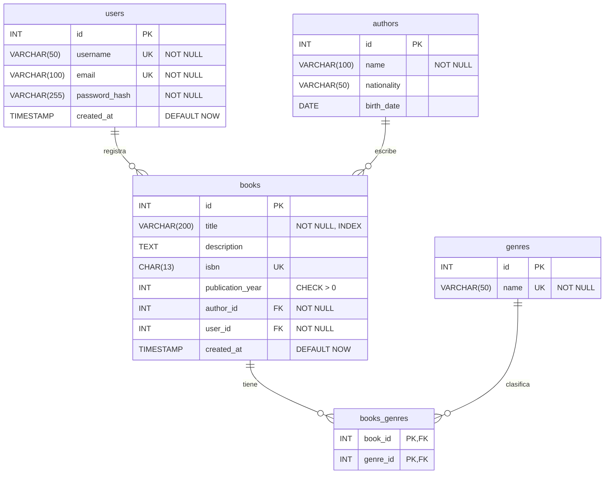
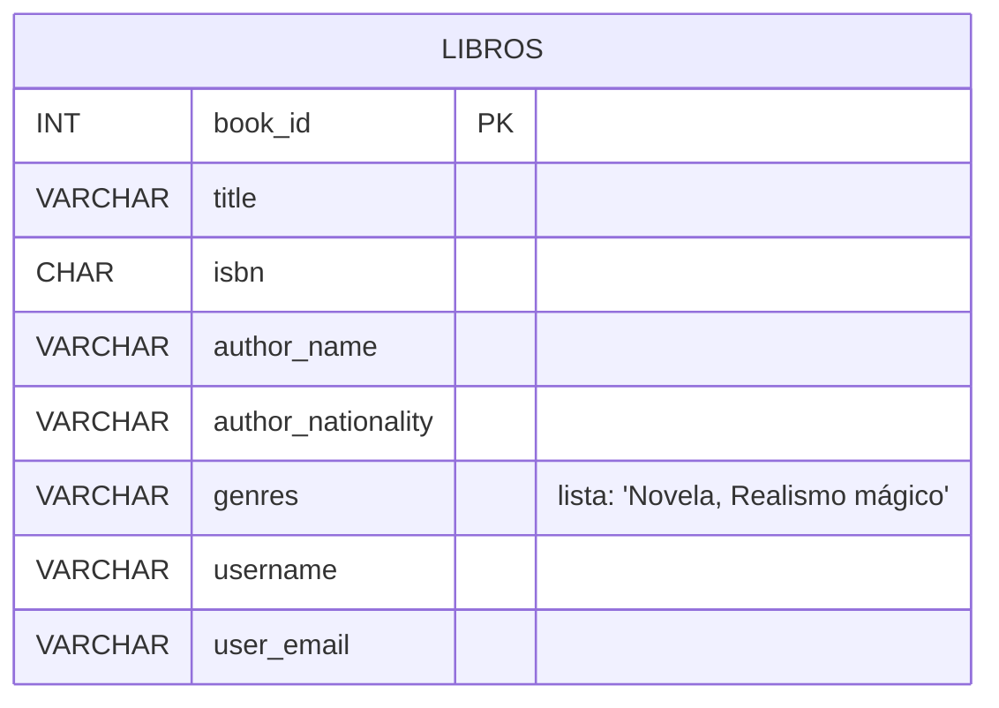
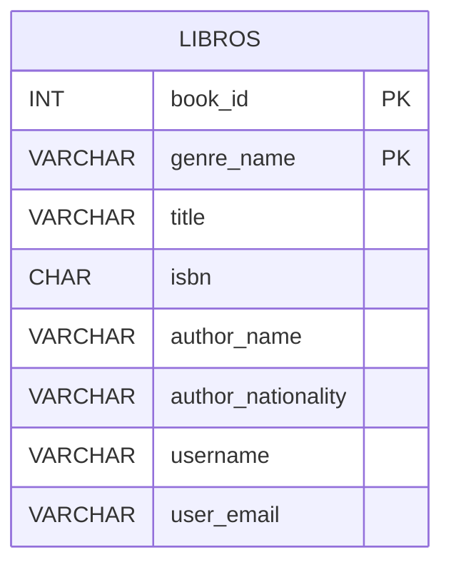
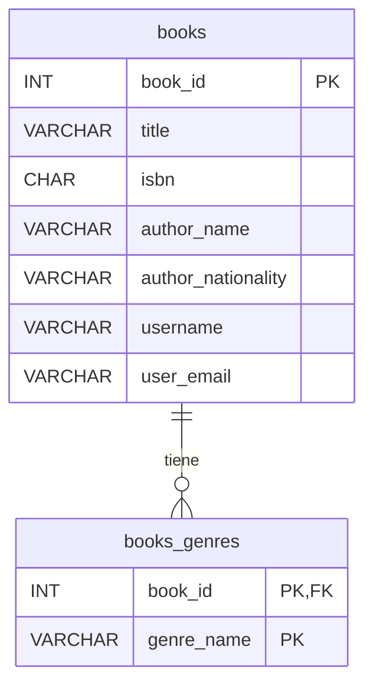
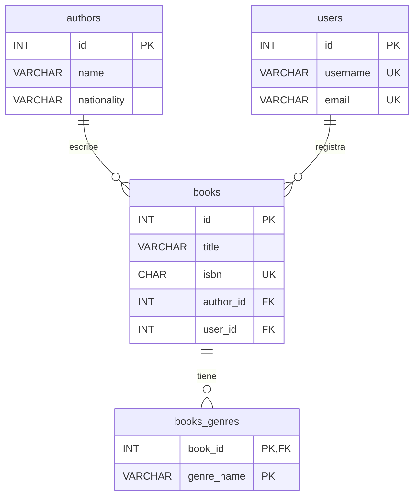
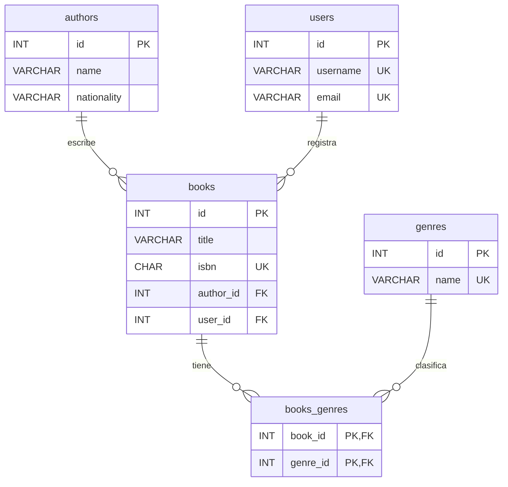

# Esquema de Base de Datos — CRUD de Libros

Modelo relacional con 4 entidades (`users`, `authors`, `genres`, `books`) y 1 tabla intermedia (`books_genres`), en notación **Crow's Foot (pata de gallo)** y normalizado hasta **4FN**.

## 1. Modelo conceptual

| Entidad A | Relación  | Entidad B | Cardinalidad |
|-----------|-----------|-----------|--------------|
| authors   | escribe   | books     | 1 : N        |
| users     | registra  | books     | 1 : N        |
| books     | pertenece | genres    | **N : N**    |

> **Regla práctica:** en una relación 1:N la FK va en el lado "N" → `author_id` y `user_id` viven en `books`.
>
> **Las relaciones N:N no se pueden implementar directamente:** un libro puede ser "Novela" y "Realismo mágico" a la vez, y "Novela" agrupa muchos libros. No cabe una FK directa, así que se crea la tabla intermedia `books_genres`.

## 2. Diagrama E-R (pata de gallo)



Lectura de los símbolos:

| Símbolo | Significado |
|---------|-------------|
| `\|\|`  | exactamente uno (un libro tiene **un** autor y **un** usuario que lo registró) |
| `o{`    | cero o muchos (un autor puede tener **0..N** libros; un libro puede aparecer en **0..N** filas de `books_genres`) |

La relación N:N `books ↔ genres` se descompone en dos 1:N que apuntan a `books_genres`.

## 3. Normalización paso a paso

Usamos siempre los mismos datos de ejemplo para ver cómo cambia el esquema en cada nivel.

### Paso 0 — Sin normalizar

Todo en una sola tabla, tal como lo apuntaríamos en una hoja de cálculo:

| book_id | title | isbn | author_name | author_nationality | genres | username | user_email |
|---|---|---|---|---|---|---|---|
| 1 | Cien años de soledad | 9780307474728 | García Márquez | Colombia | **Novela, Realismo mágico** | ana | ana@mail.com |
| 2 | El amor en los tiempos del cólera | 9780307387264 | García Márquez | Colombia | **Novela** | ana | ana@mail.com |



❌ **Problema:** `genres` guarda una **lista** en una celda. No se puede filtrar bien por género ni evitar erratas ("novela" vs "Novela").

---

### Paso 1 — 1FN: atributos atómicos

> **Regla:** sin listas ni campos repetidos dentro de una misma celda.

Rompemos la lista: **una fila por cada par libro–género**. Como `book_id` ya no es único, la clave pasa a ser compuesta: `(book_id, genre_name)`.

| book_id | genre_name | title | isbn | author_name | author_nationality | username | user_email |
|---|---|---|---|---|---|---|---|
| 1 | Novela | Cien años de soledad | 9780307474728 | García Márquez | Colombia | ana | ana@mail.com |
| 1 | Realismo mágico | Cien años de soledad | 9780307474728 | García Márquez | Colombia | ana | ana@mail.com |
| 2 | Novela | El amor en los tiempos del cólera | 9780307387264 | García Márquez | Colombia | ana | ana@mail.com |



✅ Cada celda tiene un único valor.
❌ **Problema:** "Cien años de soledad" y su ISBN aparecen **dos veces**. Si corrijo el título en una fila y no en la otra, los datos se contradicen.

---

### Paso 2 — 2FN: dependencia de la clave completa

> **Regla:** cumple 1FN y cada campo depende de **toda** la clave, no solo de una parte.

La clave es `(book_id, genre_name)`, pero `title`, `isbn`, `author_*` y `user_*` dependen **solo de `book_id`**: es una dependencia parcial. Separamos en dos tablas unidas por `book_id`:

**books**

| book_id | title | isbn | author_name | author_nationality | username | user_email |
|---|---|---|---|---|---|---|
| 1 | Cien años de soledad | 9780307474728 | García Márquez | Colombia | ana | ana@mail.com |
| 2 | El amor en los tiempos del cólera | 9780307387264 | García Márquez | Colombia | ana | ana@mail.com |

**books_genres**

| book_id | genre_name |
|---|---|
| 1 | Novela |
| 1 | Realismo mágico |
| 2 | Novela |



✅ Cada libro aparece una sola vez.
❌ **Problema:** "García Márquez / Colombia" y "ana / ana@mail.com" se siguen repitiendo en cada libro.

---

### Paso 3 — 3FN: sin dependencias transitivas

> **Regla:** cumple 2FN y los campos que no son clave no dependen de otros campos que tampoco son clave.

En `books` hay dos cadenas **transitivas**:

- `book_id → author_name → author_nationality`: la nacionalidad es del **autor**, no del libro.
- `book_id → username → user_email`: el email es del **usuario**, no del libro.

Cada cadena pasa a su propia entidad con su propio `id`, y `books` solo guarda la FK (en el lado "N" de la relación 1:N):

**authors**

| id | name | nationality |
|---|---|---|
| 1 | García Márquez | Colombia |

**users**

| id | username | email |
|---|---|---|
| 1 | ana | ana@mail.com |

**books**

| id | title | isbn | author_id | user_id |
|---|---|---|---|---|
| 1 | Cien años de soledad | 9780307474728 | 1 | 1 |
| 2 | El amor en los tiempos del cólera | 9780307387264 | 1 | 1 |

**books_genres** (sin cambios)

| book_id | genre_name |
|---|---|
| 1 | Novela |
| 1 | Realismo mágico |
| 2 | Novela |



✅ Cambiar el email de Ana o la nacionalidad de un autor es un único `UPDATE`.
❌ **Problema pendiente:** el género sigue siendo **texto libre** repetido en `books_genres`. Nada impide escribir "Novela" en un sitio y "novela" en otro, y no hay un catálogo de géneros.

---

### Paso 4 — 4FN: multivaluados en tabla puente

> **Regla:** cumple 3FN y los campos multivaluados se identifican con su propia clave única, en una tabla puente.

Un libro tiene **varios** géneros y un género está en **varios** libros: es una relación **N:N**. `genre` pasa a ser su propia entidad (`genres`, con `name UNIQUE`), y `books_genres` queda como **tabla intermedia pura**, con dos FK que juntas forman su PK compuesta:

**genres**

| id | name |
|---|---|
| 1 | Novela |
| 2 | Realismo mágico |

**books_genres**

| book_id | genre_id |
|---|---|
| 1 | 1 |
| 1 | 2 |
| 2 | 1 |



✅ **Resultado final:** 4 entidades (`users`, `authors`, `books`, `genres`) más 1 tabla intermedia (`books_genres`), sin redundancia y cada una con una única responsabilidad. Es el esquema completo de la sección 2.

### Resumen de la evolución

| Paso | Tablas | Qué se corrige |
|---|---|---|
| 0 · Sin normalizar | `LIBROS` | — |
| 1 · 1FN | `LIBROS` (PK compuesta) | listas dentro de una celda |
| 2 · 2FN | `books`, `books_genres` | datos del libro repetidos por cada género |
| 3 · 3FN | `books`, `books_genres`, `authors`, `users` | datos de autor/usuario repetidos en cada libro |
| 4 · 4FN | `books`, `books_genres`, `authors`, `users`, `genres` | géneros como texto libre → catálogo + tabla puente N:N |


## 4. Constraints usadas

| Constraint | Dónde |
|---|---|
| `PRIMARY KEY` | `id` en las 4 entidades; **compuesta** `(book_id, genre_id)` en `books_genres` (evita asignar dos veces el mismo género a un libro) |
| `FOREIGN KEY` | `books.author_id`, `books.user_id`, `books_genres.book_id`, `books_genres.genre_id` |
| `ON DELETE CASCADE` | en `books_genres`: si se borra un libro o un género, desaparecen sus filas puente |
| `NOT NULL` | campos obligatorios y todas las FK |
| `UNIQUE` | `users.username`, `users.email`, `genres.name`, `books.isbn` |
| `CHECK` | `books.publication_year > 0` |
| `DEFAULT` | `created_at = CURRENT_TIMESTAMP` |
| `INDEX` | `books.title` (búsquedas por título) |

## 5. SQL (MySQL)

El script completo está en [`schema.sql`](schema.sql). Consulta de ejemplo: todos los libros con sus géneros.

```sql
SELECT b.title, a.name AS author, g.name AS genre
FROM books b
JOIN authors a       ON a.id = b.author_id
JOIN books_genres bg ON bg.book_id = b.id
JOIN genres g        ON g.id = bg.genre_id;
```
