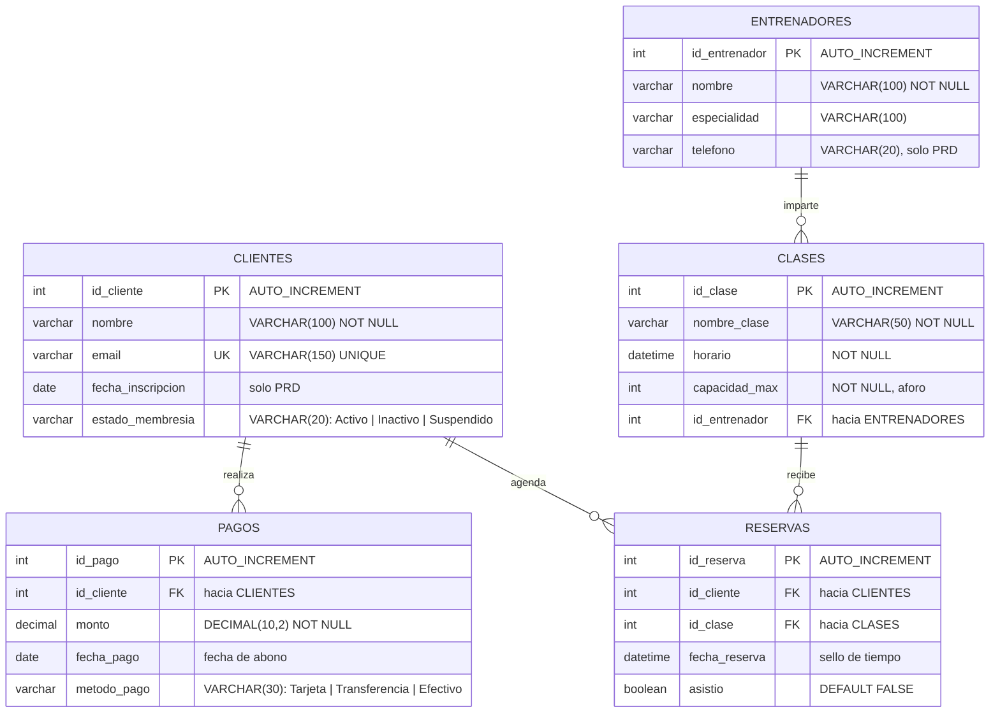

# Diagrama ER — GymFlow

> Transcripción a Mermaid del diagrama original del cliente
> (`Diagrama_ER.png`, copiado en este repo como
> [Diagrama_ER.png](Diagrama_ER.png)). El diccionario de datos completo está en
> [DATABASE_SPEC.md](DATABASE_SPEC.md).

## Lectura de las relaciones

| Relación | Mermaid | Significado |
|---|---|---|
| `CLIENTES` → `PAGOS` | `||--o{` | Un cliente realiza **cero o muchos** pagos; cada pago pertenece a **exactamente uno**. |
| `ENTRENADORES` → `CLASES` | `||--o{` | Un entrenador imparte cero o muchas clases; cada clase la dirige exactamente uno. |
| `CLIENTES` → `RESERVAS` | `||--o{` | Un cliente agenda cero o muchas reservas; cada reserva es de exactamente un cliente. |
| `CLASES` → `RESERVAS` | `||--o{` | Una clase recibe cero o muchas reservas (hasta el aforo); cada reserva apunta a una clase. |

La relación N:N original entre `CLIENTES` y `CLASES` queda resuelta por la
tabla intermedia `RESERVAS`, que aporta además los atributos propios de la
relación (`fecha_reserva`, `asistio`).
